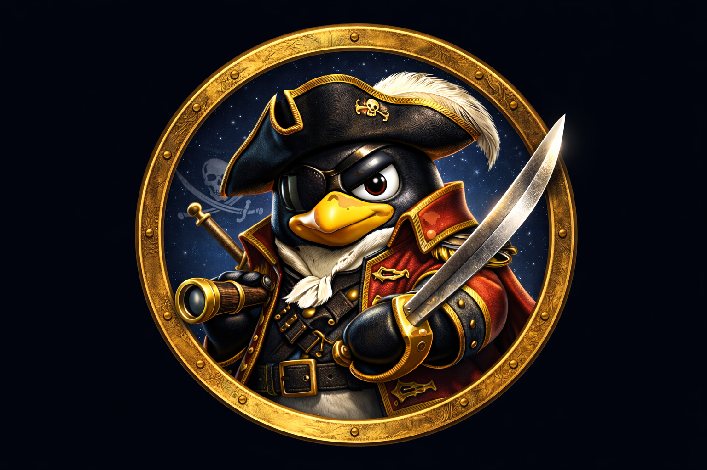
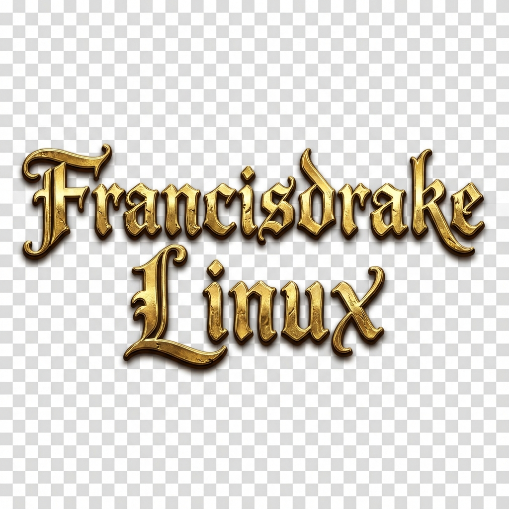
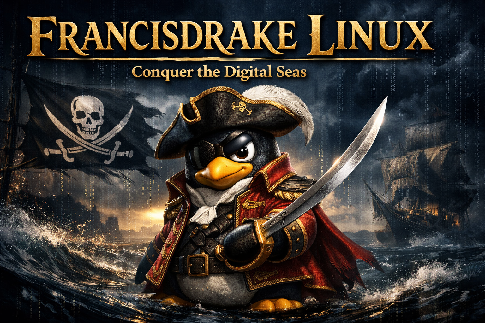

  
  
  
  
  

  ### *Sail the Digital Seas*

  [ 🇬🇧 English Version ](README.md)

---

## ⚓ Einleitung: Die Festung auf hoher See

Willkommen an Bord von **Francisdrake Linux**. Wir leben in einer Ära, in der Daten das neue Gold sind und der digitale Ozean voller Gefahren, aber auch unendlicher Möglichkeiten steckt. Francisdrake Linux ist nicht einfach nur eine weitere Linux-Distribution – es ist ein Statement. Es ist ein Werkzeug für diejenigen, die Freiheit über Konformität stellen, für Sicherheitsforscher, die präzise Instrumente benötigen, und für Enthusiasten, die Ästhetik genauso schätzen wie Funktionalität.

In einer Welt der Überwachung ist Francisdrake Linux Ihr privates Schiff, ausgestattet mit den mächtigsten Kanonen der Cybersecurity-Welt, gehüllt in ein Design, das die Romantik der großen Entdeckerzeit mit der Schärfe moderner Technologie verbindet.

---

## 🛡️ Das Fundament: Kali Linux
Francisdrake Linux wurde nicht im luftleeren Raum erschaffen. Es steht auf den Schultern eines Giganten: **Kali Linux**.

### Warum Kali?
Kali Linux ist der unangefochtene Industriestandard für Penetration Testing und digitale Forensik. Durch die Basis auf Kali erbt Francisdrake Linux eine Vielzahl entscheidender Vorteile:

1.  **Kompromisslose Sicherheit & Werkzeuge**:
    Jedes Werkzeug, das ein Sicherheitsanalyst benötigen könnte – von Wireshark über Metasploit bis hin zu Aircrack-ng – ist entweder vorinstalliert oder über die perfekt gepflegten Repositories verfügbar. Francisdrake erfindet das Rad nicht neu, sondern veredelt den bestmöglichen Unterbau.

2.  **Rolling Release Modell**:
    Basierend auf Debian Testing, ist Ihr System niemals veraltet. Sie installieren es einmal und aktualisieren es kontinuierlich. Sie haben immer den neuesten Kernel, die neuesten Treiber und die aktuellsten Versionen Ihrer Software.

3.  **Härtung & Stabilität**:
    Der Kali-Kernel ist speziell gepatcht und konfiguriert für Wireless Injection und andere Hardware-nahe Aufgaben, die mit Standard-Kerneln oft mühsam einzurichten sind.

Francisdrake Linux nimmt diese rohe, industrielle Kraft und kleidet sie in ein Gewand, das für den täglichen Einsatz („Daily Driver“) optimiert ist, ohne die Wurzeln zu verleugnen.

---

  

---

## ⚔️ Die Philosophie von Francisdrake

Unser Name ist eine Hommage an Sir Francis Drake – Freibeuter, Entdecker, Weltumsegler. Wie unser Namenspatron operieren wir oft in Grauzonen, nutzen unkonventionelle Taktiken und lassen uns von Grenzen nicht aufhalten.

### Design trifft Funktion
Die meisten Sicherheits-Distributionen sind rein utilitaristisch: spartanisch, dunkel, funktional. Francisdrake Linux geht einen anderen Weg. Wir glauben, dass ein Werkzeug, das man täglich nutzt, inspirierend sein sollte.

*   **Visuelle Identität**: Ein tiefes Ozeanblau, akzentuiert mit antikem Gold und pergamentartigem Weiß.
*   **Typografie**: Eine sorgfältige Auswahl an Schriften, die Lesbarkeit mit Charakter verbinden.
*   **User Experience**: Während Kali oft Expertenwissen voraussetzt, bemüht sich Francisdrake um eine zugänglichere Oberfläche, ohne die Expertenfunktionen zu verstecken.

### Für wen ist dieses System?
*   **Penetration Tester**, die ein System wollen, das "out of the box" beeindruckend aussieht.
*   **CTF (Capture The Flag) Spieler**, die eine inspirierende Umgebung für ihre Wettbewerbe suchen.
*   **Datenschutz-Advokaten**, die ein gehärtetes System benötigen.
*   **Linux-Enthusiasten**, die das Besondere suchen und Standard-Desktops leid sind.

---

## 🚀 Features & Ausblick

| Feature | Status | Beschreibung |
| :--- | :---: | :--- |
| **Kali Base** | ✅ | Vollständige Kompatibilität mit Kali 2025.x Repositories. |
| **Custom Branding** | ✅ | Einzigartige Boot-Logos, Hintergründe und Terminal-Ästhetik. |
| **Optimierte Shell** | 🚧 | Vor-konfigurierte ZSH mit Syntax-Highlighting und Powerlevel10k Theme im Francisdrake-Stil. |
| **Anonymität** | 🚧 | Geplante Ein-Klick-Integration von Tor und Anonsurf-Tools. |

---

  
  
  
<em>"Es ist nicht wichtig, wie groß das Schiff ist, sondern wie wild der Ozean ist, den es bezwingt."</em>

---

### Rechtlicher Hinweis
*Francisdrake Linux basiert auf Kali Linux. Wie bei Kali Linux sind die enthaltenen Werkzeuge mächtig und potenziell gefährlich. Sie sind für Bildungszwecke, autorisierte Sicherheitsüberprüfungen und Netzwerkdiagnosen gedacht. Der Nutzer ist allein verantwortlich für die Einhaltung aller geltenden Gesetze bei der Verwendung dieser Software.*
